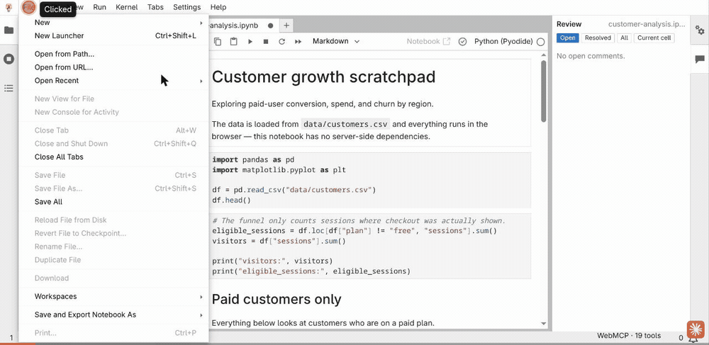

# JupyterLite WebMCP

> **Your notebook is already in the browser. Now your agent can be too.**

**Live demo: <https://jupyterlite-web-mcp.vercel.app/lab/index.html>**
No sign-in, no server, no configuration — the notebooks, the files and the
Python kernel all run in your browser tab.

[](LICENSE)
[](https://github.com/alliecatowo/jupyterlite-web-mcp/actions/workflows/test.yml)




Recorded on the live demo above, in Chrome with WebMCP enabled, driving the
extension through the real `document.modelContext` API. In order: ordinary
JupyterLite with the status bar reading `WebMCP · 19 tools`; the agent
opening `customer-analysis.ipynb` and running it; the human selecting
`converted / visitors` by hand; the agent reading that exact selection,
fixing only that expression and re-running the cell so the printed
conversion rate changes; the agent scrolling the notebook to
`eligible_sessions` to point back at the human; and a review thread anchored
to the corrected expression. The full shot list is in
[`docs/demo-script.md`](docs/demo-script.md).

## What it is

A JupyterLab frontend extension — no server extension, no backend, no API
keys, no chat UI, no LLM of its own — that exposes the live notebook
workspace to a compatible browser agent through
[WebMCP](https://github.com/webmachinelearning/webmcp)
(`document.modelContext.registerTool`). The agent reads, edits, runs, and
*reviews* the same notebook the human already has open: the same unsaved
edits, the same selection, the same kernel, the same outputs, the same
review threads. Turn WebMCP off and the notebook — including the Review
panel — works exactly the same; the extension only adds a tool surface, it
never gates one.

## Why this is different

- **Same live document, not a copy.** The agent reads and writes the
  in-memory `NotebookPanel` model the human is looking at — unsaved edits,
  current text selection, the one shared kernel — and every mutating tool
  is refused with a structured `STALE_CELL` error if the cell changed since
  the agent last read it. A concurrent human edit always wins.
- **The notebook is the record.** There is no hidden execution path: the
  agent cannot run an arbitrary string of code, only cells that already
  visibly exist. To compute something new it has to insert a visible cell
  and run it, the same way a human collaborator would — and the review
  conversation itself is stored inside the `.ipynb` file you download, not
  in a side channel that disappears when the tab closes.
- **It points back.** The agent can scroll the human's notebook to an exact
  expression to say "this one"; the human can select code by hand and have
  the agent read exactly that substring. Pointing is bidirectional.

**What WebMCP cannot do:** a page cannot wake, summon, or notify an agent.
Editing a cell or leaving a review comment doesn't call anyone — it changes
the state an agent will see the next time a human invokes it.

## Install

Not yet published to PyPI or npm — install from source or directly from
git. Requires JupyterLab 4.6 (also works in Notebook 7, which ships on the
same codebase, and in JupyterLite).

**From a clone:**

```bash
pip install ./packages/jupyterlite-webmcp
```

**Directly from git, no clone needed:**

```bash
pip install "git+https://github.com/alliecatowo/jupyterlite-web-mcp.git#subdirectory=packages/jupyterlite-webmcp"
```

Either command installs a prebuilt frontend extension — no local Node.js
build step required. Verify with:

```bash
jupyter labextension list   # should show jupyterlite-webmcp enabled OK
```

**For a JupyterLite deployment,** add the same requirement line to the
site's `requirements.txt`:

```text
-e ./packages/jupyterlite-webmcp
# or: git+https://github.com/alliecatowo/jupyterlite-web-mcp.git#subdirectory=packages/jupyterlite-webmcp
```

then rebuild the site:

```bash
jupyter lite build --contents content --output-dir dist
```

See [`docs/install.md`](docs/install.md) for the full walkthrough, including
what each platform (JupyterLab, Notebook 7, JupyterLite) was independently
verified to do.

<details>
<summary><strong>Tools (22 registered)</strong></summary>

Full documentation, including inputs, outputs, bounds, and error codes, is
in [`docs/webmcp-tools.md`](docs/webmcp-tools.md).

| Tool | Read/Write | Purpose |
| --- | --- | --- |
| `jupyter_get_context` | read | Live workspace, notebook, kernel, focus and selection state. |
| `jupyter_list_workspace` | read | List files/directories in the browser-local workspace. |
| `jupyter_open_notebook` | write (UI) | Open a notebook and bring it to the front. |
| `jupyter_create_notebook` | write | Create and open a new, empty notebook. |
| `jupyter_get_cells` | read | Read live cells, including unsaved edits, with source hashes. |
| `jupyter_get_cell_access` | read | Report per-cell agent access (write/read/none) and provenance history. |
| `jupyter_insert_cell` | write | Insert a visible cell; never executes it. |
| `jupyter_update_cell` | write | Replace a cell's source, guarded by a source hash. |
| `jupyter_delete_cell` | write | Delete a cell, guarded by a source hash. |
| `jupyter_run_cells` | write | Execute existing cells on the shared kernel. |
| `jupyter_focus_cell` | write (view) | Scroll to, select, and set the cursor/selection in a cell. |
| `jupyter_save_notebook` | write | Save the notebook to the browser-local workspace. |
| `jupyter_kernel_action` | write | Interrupt or restart the shared kernel. |
| `jupyter_list_comments` | read | List review threads for a notebook. |
| `jupyter_get_comment` | read | Read one review thread in full, with anchor status. |
| `jupyter_create_comment` | write | Create a review thread (cell, source-range, or output). |
| `jupyter_reply_comment` | write | Append a message to an existing thread. |
| `jupyter_resolve_comment` | write | Mark a thread resolved, preserving history. |
| `jupyter_reopen_comment` | write | Reopen a resolved thread. |
| `jupyter_focus_comment` | write (view) | Scroll to and select what a thread is anchored to. |
| `jupyter_export_notebook` | read | Export the notebook as a bounded markdown document. |
| `jupyter_get_output_selection` | read | Read the user's last selected output text, if any. |

</details>

<details>
<summary><strong>Review comments</strong></summary>

Review is an ordinary notebook feature, not an AI feature: a human can
create, reply to, resolve, reopen, and navigate threaded comments anchored
to a cell, an exact range of source text, or a cell output, entirely without
a browser agent, from a right-sidebar "Review" panel. Comments are stored in
the notebook's own metadata (see `docs/review-comments.md`), so they travel
with the downloaded `.ipynb` file — no comment server, no account service.

A compatible browser agent can participate in the same threads through
seven WebMCP tools: it can list and read threads, create new ones, reply,
resolve, reopen, and navigate to one. Nothing about creating or replying to
a comment calls or notifies the agent.

</details>

<details>
<summary><strong>Architecture</strong></summary>

See [`docs/architecture.md`](docs/architecture.md) for the full picture. In
short:

```text
JupyterLab APIs -> src/jupyter/* adapter -> semantic operations -> src/webmcp/* adapter
```

The two plugins are `jupyterlite-webmcp:review` (the notebook comment
feature; works with or without WebMCP) and `jupyterlite-webmcp:tools` (the
WebMCP tool registration, which depends on the review plugin so it can
expose comment tools).

</details>

<details>
<summary><strong>Local development</strong></summary>

```bash
# Python environment (uv is used in this repo; python -m venv also works)
uv venv --python 3.11 .venv
uv pip install --python .venv/bin/python -r requirements.txt

# Build the extension
cd packages/jupyterlite-webmcp
npm install
npm run build:prod
cd ../..

# Build and serve the JupyterLite site
.venv/bin/jupyter lite build --contents content --output-dir dist
.venv/bin/jupyter lite serve --output-dir dist
```

`requirements.txt` installs `packages/jupyterlite-webmcp` in editable mode,
so the extension is picked up automatically.

</details>

<details>
<summary><strong>Testing</strong></summary>

```bash
cd packages/jupyterlite-webmcp && npm test        # 218 unit tests (jest)
cd packages/jupyterlite-webmcp && npm run lint:check
cd packages/jupyterlite-webmcp && npm run typecheck
cd ui-tests && npm install && npx playwright test  # 37 browser tests
```

To drive the tools by hand in a real browser — useful because no browser
ships `document.modelContext` yet — serve a shim-injected copy of the built
site:

```bash
./ui-tests/make-shim-site.sh          # serves http://127.0.0.1:8766
```

Then, in that page's console, `window.__webmcp.call('jupyter_get_context', {})`
invokes a tool exactly the way an agent would. The shim lives in `ui-tests/`,
is never part of the extension, and is never injected into the deployed site.

`.github/workflows/test.yml` runs lint, typecheck, unit tests, an extension
build, a JupyterLite site build, and the full Playwright suite on every push
and pull request — all green.

</details>

<details>
<summary><strong>Security</strong></summary>

Notebook content — cell source, outputs, and comment bodies — is untrusted
user data: it can contain text written to look like an instruction to an
agent. Every tool that can return notebook content sets
`untrustedContentHint: true` in its WebMCP annotations, so a well-behaved
agent can treat it as data rather than as commands.

Execution only ever happens through the explicit `jupyter_run_cells` tool,
on cells that already visibly exist in the notebook. There is no way to
execute an arbitrary source string, and there is no hidden kernel
introspection tool: if an agent needs to compute something new (for example
to answer a review comment), it must insert a visible cell and run it, the
same way a human would.

Every write tool that mutates a cell's source (`jupyter_update_cell`,
`jupyter_delete_cell`) requires the `sourceHash` from a previous read. If the
cell changed in the meantime, the write is refused with a structured
`STALE_CELL` error rather than silently overwriting a human's edit.

The extension never reads or exposes cookies, browser auth tokens, unrelated
`localStorage`, or any secret outside the notebook workspace itself. Tool
results are bounded in size (see the limits table in `docs/architecture.md`)
so a single call cannot return an unbounded amount of notebook data.

The live demo is served cross-origin isolated (`Cross-Origin-Opener-Policy:
same-origin`, `Cross-Origin-Embedder-Policy: credentialless`), verified as
`crossOriginIsolated === true` with `SharedArrayBuffer` available, so the
Pyodide kernel runs on a real `SharedArrayBuffer` worker instead of the
service-worker fallback.

</details>

<details>
<summary><strong>WebMCP compatibility</strong></summary>

The extension uses the current imperative
`document.modelContext.registerTool()` API. It does not use the obsolete
`navigator.modelContext` or `provideContext` APIs, and it does not implement
the declarative (HTML-attribute) form of WebMCP. Tools are registered once,
at plugin activation, and are never unregistered or re-registered as the
notebook, cell focus, cursor, selection, or kernel state changes — those are
state changes, not capability changes, and every tool reads current state
when it is invoked. Long-running tool invocations (`jupyter_run_cells`)
honor the `AbortSignal` passed by the WebMCP runtime, but an abort only
interrupts execution *that invocation itself started* — the kernel is
shared with the human, so the tool never interrupts work the human launched
manually.

Verified in Chrome 150 with WebMCP enabled, on the live demo, through the
real `document.modelContext`: all 22 tools register, `getTools()` returns
them with annotations intact, `executeTool()` round-trips, and the status
bar reflects that an agent is connected. With WebMCP off,
`document.modelContext` is `undefined`, both plugins still activate, the
Review panel still works, and the status bar reflects that no agent is
connected.

**WebMCP cannot wake, summon, or notify an agent.** Selecting code, editing
a cell, moving a widget slider, or adding or replying to a review comment
never calls the agent and never triggers anything automatically. These
actions simply change the live state that a browser agent will see the next
time the human invokes it.

Full implementation notes, including Chrome's actual calling convention and
why three otherwise-read-only tools are marked `readOnlyHint: false`, are in
[`docs/webmcp-compatibility.md`](docs/webmcp-compatibility.md).

</details>

<details>
<summary><strong>License / attribution</strong></summary>

This project is MIT licensed; see `LICENSE`. The deployment substrate
(JupyterLite build/config layout, `requirements.txt` pins, and the GitHub
Pages workflow) is derived from `jupyterlite/demo` (BSD 3-Clause, Copyright
Project Jupyter Contributors). `jupyterlab-ai-commands` (BSD 3-Clause,
Project Jupyter) was studied as an implementation reference for JupyterLab
notebook, cell, and execution plumbing; it is not a runtime dependency and
no code from it was copied verbatim. Full third-party attribution is in
`NOTICE.md`.

</details>

See `docs/submission.md` for the product/competition positioning.
