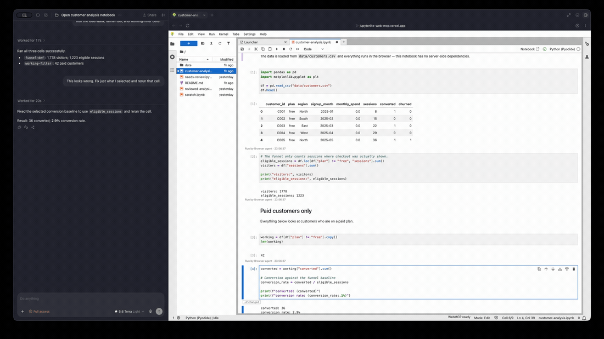
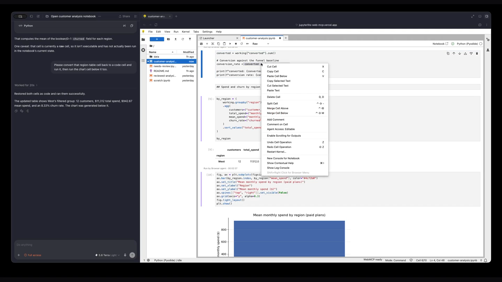
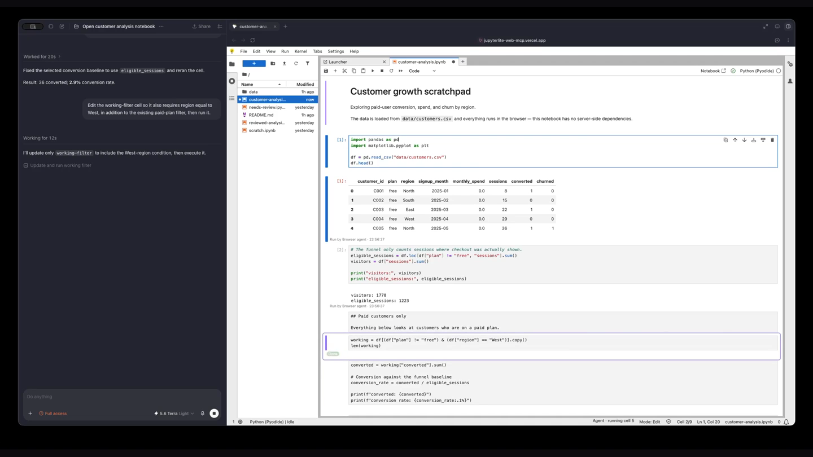
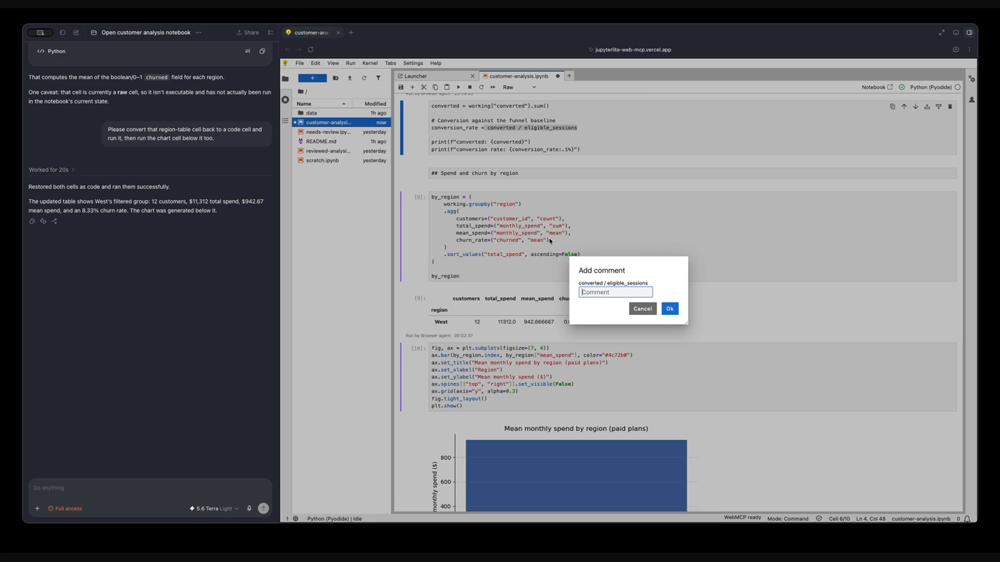

# JupyterLite WebMCP

<div align="center">



<sub>The agent proposes a one-line fix inline. The diff is reviewable before it sticks — same cell, same kernel, same tab.</sub>

<br/><br/>

<table>
<tr>
<td width="33%" valign="top">

<br/><sub><b>Per-cell access control</b> — grant or lock the agent's write access, cell by cell.</sub>
</td>
<td width="33%" valign="top">

<br/><sub><b>Live presence</b> — the status bar shows exactly what the agent is doing, as it happens.</sub>
</td>
<td width="33%" valign="top">

<br/><sub><b>Inline review</b> — comment on any cell; the agent reads it next turn and replies in the same thread.</sub>
</td>
</tr>
</table>

</div>

---

> **A portable semantic interface to a browser-native computational workspace.**
> Your notebook is already in the browser. Now your agent can be too.

**Live demo: <https://jupyterlite-web-mcp.vercel.app/lab/index.html>**
No sign-in, no server, no configuration — the notebooks, the files and the
Python kernel all run in your browser tab.

[](LICENSE)
[](https://github.com/alliecatowo/jupyterlite-web-mcp/actions/workflows/test.yml)


A JupyterLab frontend extension — no server extension, no backend, no API
keys, no chat UI, no LLM of its own — that exposes the *live* notebook
workspace to a compatible browser agent through
[WebMCP](https://github.com/webmachinelearning/webmcp)
(`document.modelContext.registerTool`). 22 tools let the agent read,
navigate, edit, execute, and *review* the exact notebook the human already
has open: the same unsaved edits, the same text selection, the same kernel,
the same outputs, the same review threads.

---

## The problem, and who has it

A working notebook lives in a browser tab, and almost nothing about it
exists on disk. The cell you just typed and haven't saved. The eleven
characters you highlighted with your mouse because they look wrong. The
kernel holding your DataFrame in memory. The chart that only rendered
because you ran cells in that order.

Getting an AI to help with that means one of two bad deals today:

- **Copy-paste into a chat window.** The model sees a dead snapshot, gives
  you back text, and you re-key it. It cannot see what you selected, cannot
  run anything, and cannot know what already ran.
- **Bolt in a server-side MCP integration.** It reads `.ipynb` *bytes off
  disk* — which is to say, it reads a file that does not match your screen —
  and it needs a Jupyter server, credentials, and infrastructure you may not
  have. On JupyterLite there is no server to talk to at all.

Both start by making a **copy**. The copy is wrong the instant you touch the
keyboard.

The audience is everyone who already runs a notebook in a browser tab:
JupyterLab and Notebook 7 users, every JupyterLite deployment, every
teaching site, every "run this in your browser, no install" tutorial.

## Why this is specifically a strong WebMCP use case

**The state that matters exists only inside the tab, and WebMCP is the only
way to reach it.**

Every one of the 22 tools operates on state that no server-based MCP
integration can see, because there is no server holding it:

| State | Why only WebMCP can reach it |
| --- | --- |
| The live `NotebookPanel` model | Unsaved edits exist in browser memory. `jupyter_get_cells` reads `sharedModel.getSource()`, never `.ipynb` bytes. |
| The human's mouse selection | `focus.textSelection` is the exact substring highlighted in the CodeMirror editor right now. There is no file, socket, or API that has this. |
| The in-browser Pyodide kernel | `jupyter_run_cells` runs on the *same* WebAssembly kernel the human is using, with the same variables already in memory. |
| A selection inside a rendered output | Captured only when it lies wholly inside one output, with a fingerprint so a later read can tell if that output was replaced. |
| The IndexedDB-backed workspace | `jupyter_list_workspace` lists files that only exist in this browser profile. |
| Review threads in notebook metadata | Written into the in-memory model, so the agent and the human are in one conversation, not two. |

On a JupyterLite deployment — a static site with no backend of any kind —
WebMCP is not the convenient option. It is the only one.

### Verified portable — one install, three real platforms, zero code changes

Most notebook/IDE-agent projects are built against a single kernel and stay
there. This one was independently checked against all three environments
`jupyterlite-webmcp` installs into, not just the JupyterLite deployment
pictured above:

- **JupyterLite** (this repo's live demo) — the in-browser Pyodide kernel,
  exercised end-to-end by the full 52-test Playwright suite on every push.
- **A real JupyterLab 4.6 server** — `pip install`, a real ipykernel,
  `jupyter_run_cells` executing real code.
- **A real Notebook 7 server** — the *exact same* installed package, no
  branch, no build flag, no platform-specific code path.

`jupyter lab`/`jupyter notebook` ship on the same extension system, so
`pip install ./packages/jupyterlite-webmcp` is the entire install for
either — verified with a full open → read → update → run round trip
through the WebMCP tools on both, on top of the JupyterLite suite already
running on every commit. Full walkthrough:
[`docs/install.md`](docs/install.md).

**And it is not the notebook's only reason to exist.** Turn WebMCP off and
everything still works: the notebook, the Agent panel, the review threads,
the presence markers, the access controls. The extension only *adds* a tool
surface; it never gates one.

## The idea that generated everything else

One question was applied to every feature:

> **Could this still make sense if the second participant were a human
> instead of an agent?**

That single constraint produced the whole design, and you can read it off
the code:

| A second human would… | …so the agent |
| --- | --- |
| never be handed a private copy | writes to the live shared model — which is a Yjs document, so it composes with `jupyter-collaboration` with **zero** integration code ([verified](docs/multiplayer.md)) |
| never silently overwrite your unsaved edit | must present the `sourceHash` it read; a stale write is refused with `STALE_CELL`, never merged |
| never run code you can't see | has no "execute this string" tool and no hidden kernel introspection — to compute something new it inserts a **visible** cell and runs it |
| leave comments in the document, not a private DM | writes review threads into the `.ipynb`'s own metadata, which survive editing via real re-anchoring |
| be visible while working | gets presence: halos, live state badges, inline diffs, output provenance (below) |
| point, and be pointed at | reads your exact mouse selection, and can scroll *your* notebook to an expression to say "this one" |
| respect what you said was off-limits | obeys per-cell and per-notebook access levels it cannot read or change |

It is not an assistant with a scratch space. It is a **second editor in your
document**, under the rules you would give a person.

## You can see it working

This is the part that is hard to convey in a tool table, so look for it in
the demo. When the agent acts, the notebook says so — no chat transcript
required:

- **A calm ring** appears around the targeted cell, plus a decaying tint on
  its left edge, colour-coded by what the agent is doing (read / write /
  run / focus). Implemented as `box-shadow: inset`, so it can never shift
  layout, and it honors `prefers-reduced-motion`.
- **An inline state badge** under the cell input: `Reading…` → `Applying…` →
  `Running…` → `Done`, or `Failed`. Click a failed badge and a popover gives
  you the tool name, the structured error code, and the duration in
  milliseconds.
- **`±7 changed`** — a button that appears on any cell the agent edited.
  Click it and you get a real before/after line diff of exactly what changed,
  computed by a small dependency-free LCS differ that keeps unchanged lines
  as context rather than showing a wholesale remove-and-add.
- **`Run by Browser agent · 14:03:21`** under any output the agent produced,
  so a result never sits in your notebook without saying where it came from.
- **A status line that refuses to overclaim.** A page can observe exactly
  two things: whether `document.modelContext` exists and its tools
  registered, and whether one of those tools was just invoked. It *cannot*
  observe whether an agent is present or paying attention — WebMCP exposes
  no such signal. So the idle string describes the page (`WebMCP ready`,
  or `WebMCP unavailable`), and the only string that mentions an agent at all
  is the live one — `Agent · running cell 6`, `Agent · pointing at cell 3`,
  `Agent · commenting on cell 5` — which appears exactly when an agent
  demonstrably did something. It even distinguishes a call that is *genuinely
  in flight* from one that merely *just finished*, and only claims the former
  when it is true. Click it for what that means in plain language, the recent
  invocations with timings, and the published tool list.
- **Per-cell provenance.** Every cell keeps a bounded, coalesced history of
  who last changed it — `human` or `agent`, with a timestamp. Your typing is
  attributed to you automatically; the agent's writes attribute themselves.
- **`Ask about this output`** — highlight text inside a rendered output and a
  chip appears. Clicking it shows you *exactly* what would be shared, quoted
  verbatim, above the line: *"This only prepares that context — it cannot
  open, notify, or otherwise contact an agent."*

**What WebMCP cannot do:** a page cannot wake, summon, or notify an agent.
Editing a cell or leaving a review comment doesn't call anyone — it changes
the state an agent will see the next time a human invokes it. Nothing here
pretends otherwise, and the UI says so out loud.

## What humans and agents do together

- **Point at things.** Highlight `converted / visitors` with your mouse and
  say "fix just what I selected." The agent reads your exact selection, not
  the whole cell. Ask "where is churn calculated?" and the notebook scrolls
  itself and highlights the expression.
- **Share one kernel.** The agent runs cells on the kernel that already has
  your data loaded. Execution counts increment in your notebook. Outputs
  appear where you're looking.
- **Co-edit safely.** Every mutating tool requires the `sourceHash` from a
  prior read. If you changed the cell in the meantime, the agent's write is
  refused. **The human always wins.**
- **Hold a review conversation.** Comment on a cell, an exact range of source
  text, or an output. The agent can list, read, reply, resolve and reopen the
  same threads — and the whole conversation is stored in the `.ipynb` file you
  download, not in a chat log that dies with the tab.
- **Decide what the agent may touch.** Per cell and per notebook: `write`,
  `read`, or `none` (hidden — indistinguishable from a cell or file that does
  not exist). Human-only; no tool can read or change it.
- **Review before it sticks, if you want to.** Switch the Agent panel to
  **Propose mode** and `jupyter_update_cell` stops applying immediately —
  it waits, inline, for you to Accept or Deny. See below.

---

## Propose/Deny mode

Direct mode (the default) is everything above: a mutating tool call applies
immediately, guarded by `sourceHash`. **Propose mode** is the fourth thing
you can let the agent do, alongside per-cell `write`/`read`/`none` access —
a toggle in the Agent panel's header, human-only, exactly like access
levels.

With Propose mode on, `jupyter_update_cell` does not apply on call: it
stages the change as a reviewable diff **inline, under the cell it
targets** — reusing the same before/after line-diff rendering as the
`±N changed` popover, not a second diff UI — with **Accept** and **Deny**
controls. The tool call's Promise genuinely does not resolve until you
decide:

- **Accept** applies the change through the exact same code path Direct
  mode uses — there is exactly one place a cell's source is ever written.
- **Deny** resolves the call as a normal, non-error result (not a thrown
  error) carrying a reason you can type in — coded `PROPOSAL_DENIED` — so
  the agent's next turn sees *why*, not just that it was told no.
- Aborting the call (`AbortSignal`) cleanly cancels the pending proposal
  and removes the banner.
- A cell can have at most one pending proposal at a time; a second one is
  refused with `PROPOSAL_ALREADY_PENDING` rather than silently queued or
  replacing the first.

This currently covers `jupyter_update_cell`; `jupyter_insert_cell`,
`jupyter_delete_cell` and `jupyter_run_cells` still apply directly in both
modes — see [`docs/propose-mode.md`](docs/propose-mode.md) for the full
design, the reasoning behind each choice above, and why that scope stops
where it does.

---

## Try it in 60 seconds

1. Open **<https://jupyterlite-web-mcp.vercel.app/lab/index.html>** in
   ChatGPT's in-app browser, or in Google Chrome with WebMCP enabled.
2. Wait for the status bar (**bottom right**) to read **`WebMCP ready`**.
   If it reads `WebMCP unavailable`, this browser does not expose
   `document.modelContext` — the notebook still works, but there is no tool
   surface. Click the item for the full tool list.
3. Double-click **`customer-analysis.ipynb`** in the file browser and wait
   for the kernel status to go idle.
4. Give your agent this prompt:

> **Recommended prompt**
>
> ```text
> Open customer-analysis.ipynb. The conversion rate looks wrong to me —
> read the conversion-rate cell and check its denominator against how
> eligible_sessions is defined further up. If it's wrong, fix only that
> expression, rerun the cell, and leave a review comment on the line you
> changed explaining why.
> ```

Watch the notebook: it opens by itself, the targeted cell rings and reports
`Applying…`, `converted / visitors` becomes `converted / eligible_sessions`,
a **`±2 changed`** button appears (click it for the diff), the execution
count increments, the printed conversion rate changes, and a review thread
appears in the **Agent** panel (right sidebar → Comments tab).

Then do the half that has nothing to do with prompting:

- **Highlight `eligible_sessions`** with your mouse and ask the agent what
  you just selected — it reads the exact substring.
- **Right-click any cell → Agent Access → Hidden**, then ask the agent to
  read it. The cell becomes indistinguishable from one that does not exist,
  while you can still see and edit it perfectly.
- **Edit a cell by hand without saving**, then ask the agent to rewrite it.
  The write is refused and your text is untouched.

Other seeded notebooks: **`needs-review.ipynb`** (deliberate problems — hand
it to an agent and ask for a review) and **`reviewed-analysis.ipynb`** (a
finished human-and-agent session, review threads included).

---

## How WebMCP is actually implemented

Tools are registered once, at plugin activation, via the current imperative
API:

```ts
// src/webmcp/register.ts
await modelContext.registerTool({
  name: 'jupyter_update_cell',
  description: '…',
  inputSchema: { /* JSON Schema */ },
  annotations: { readOnlyHint: false, untrustedContentHint: true },
  execute: (input, options) => this._invoke(tool, input, options)
  //  → { content, structuredContent, isError }
});
```

Design decisions that matter:

- **Imperative, not declarative.** `document.modelContext.registerTool()`.
  Not the obsolete `navigator.modelContext` / `provideContext`, and not the
  HTML-attribute form.
- **Registered once, never re-registered.** Opening a notebook, moving the
  cursor, changing the selection or restarting the kernel are *state*
  changes, not *capability* changes. Every tool reads current state when it
  is invoked, so the tool list never churns underneath the agent.
- **Graceful absence.** If `document.modelContext` is `undefined`, every
  plugin still activates, the whole UI still works, and the status bar reads
  `WebMCP unavailable`. Registration failure surfaces as `WebMCP error` with
  the reason on hover — never swallowed.
- **`AbortSignal` honored** by `jupyter_run_cells` — but an abort only
  interrupts execution *that invocation itself started*. The kernel is shared
  with the human, so the tool never kills work the human launched. Also
  honored by `jupyter_update_cell` in Propose mode, where an aborted call
  cleanly cancels a proposal that is genuinely still waiting on the human
  ([`docs/propose-mode.md`](docs/propose-mode.md)).
- **Untrusted-content annotations.** Notebook source, outputs and comment
  bodies are attacker-controllable text. Every tool that can return notebook
  content sets `untrustedContentHint: true` so a well-behaved agent treats it
  as data, not as instructions.
- **Everything is bounded.** `src/limits.ts` holds every size cap in one
  place, and `boundJson()` in `src/webmcp/results.ts` applies them to *both*
  the text and `structuredContent` copies of every result, so one call cannot
  drain a notebook. Write inputs are the deliberate exception: an oversized
  `source` is **rejected**, never silently truncated, because a write is real
  content the human keeps.
- **Structured errors, not prose.** `STALE_CELL`, `CELL_NOT_FOUND`,
  `NOTEBOOK_NOT_FOUND`, `CELL_ACCESS_DENIED`, `NOTEBOOK_ACCESS_DENIED`,
  `KERNEL_UNAVAILABLE`, `INVALID_ARGUMENT`, `PATH_EXISTS`,
  `PROPOSAL_ALREADY_PENDING` — with hidden things deliberately reported as
  *not found*, never with a leakier code. A **denied** proposal (below)
  is deliberately the exception: it is not an error at all, so the agent's
  next turn reads it as a normal result, not a failure to recover from.
- **Defensive handlers.** Numeric ranges, enumerations and bounded text are
  validated inside each handler rather than assuming the WebMCP client
  enforced the JSON Schema. `startIndex: -1` is an `INVALID_ARGUMENT`, never
  clamped.

Verified in Chrome 150 with WebMCP enabled, on the live demo, through the
real `document.modelContext`: all 22 tools register, `getTools()` returns
them with annotations intact, and `executeTool()` round-trips.
Implementation notes, including Chrome's actual calling convention and why
three otherwise-read-only tools are marked `readOnlyHint: false`, are in
[`docs/webmcp-compatibility.md`](docs/webmcp-compatibility.md).

## The tools (22)

Full inputs, outputs, bounds and error codes:
[`docs/webmcp-tools.md`](docs/webmcp-tools.md).

| Tool | Read/Write | Purpose |
| --- | --- | --- |
| `jupyter_get_context` | read | Live workspace, notebook, kernel, focus and selection state. |
| `jupyter_list_workspace` | read | List files/directories in the browser-local workspace. |
| `jupyter_open_notebook` | write (UI) | Open a notebook and bring it to the front. |
| `jupyter_create_notebook` | write | Create and open a new, empty notebook. |
| `jupyter_get_cells` | read | Read live cells, including unsaved edits, with source hashes. |
| `jupyter_get_cell_access` | read | Report per-cell agent access (write/read/none) and provenance history. |
| `jupyter_insert_cell` | write | Insert a visible cell; never executes it. |
| `jupyter_update_cell` | write | Replace a cell's source, guarded by a source hash. |
| `jupyter_delete_cell` | write | Delete a cell, guarded by a source hash. |
| `jupyter_run_cells` | write | Execute existing cells on the shared kernel. |
| `jupyter_focus_cell` | write (view) | Scroll to, select, and set the cursor/selection in a cell. |
| `jupyter_save_notebook` | write | Save the notebook to the browser-local workspace. |
| `jupyter_kernel_action` | write | Interrupt or restart the shared kernel. |
| `jupyter_list_comments` | read | List review threads for a notebook. |
| `jupyter_get_comment` | read | Read one review thread in full, with anchor status. |
| `jupyter_create_comment` | write | Create a review thread (cell, source-range, or output). |
| `jupyter_reply_comment` | write | Append a message to an existing thread. |
| `jupyter_resolve_comment` | write | Mark a thread resolved, preserving history. |
| `jupyter_reopen_comment` | write | Reopen a resolved thread. |
| `jupyter_focus_comment` | write (view) | Scroll to and select what a thread is anchored to. |
| `jupyter_export_notebook` | read | Export the notebook as a bounded markdown document. |
| `jupyter_get_output_selection` | read | Read the user's last selected output text, if any. |

## Architecture

Full detail in [`docs/architecture.md`](docs/architecture.md). A one-way
dependency chain, with no cycles and no DOM/CSS selectors on any correctness
path:

```text
JupyterLab APIs → src/jupyter/*  (adapter: notebooks, cells, execution, focus)
                     ↓
                  semantic operations (access guards, hashing, bounds, review)
                     ↓
                  src/webmcp/*   (adapter: schemas, registration, result envelopes)
                     ↓
                  document.modelContext
```

Seven small plugins keep notebook features decoupled from WebMCP:

| Plugin | Works without WebMCP? | Role |
| --- | --- | --- |
| `jupyterlite-webmcp:review` | yes | Threaded comments in notebook metadata, plus per-cell comment markers. |
| `jupyterlite-webmcp:access` | yes | Per-cell / per-notebook access levels, restricted-cell markers, and human-edit provenance. |
| `jupyterlite-webmcp:activity` | yes | The bounded, in-memory log of recent tool activity. |
| `jupyterlite-webmcp:propose` | yes | The Direct/Propose mode toggle and the pending-proposal state machine ([`docs/propose-mode.md`](docs/propose-mode.md)). |
| `jupyterlite-webmcp:panel` | yes | The right-sidebar **Agent** panel (Activity / Comments / Access), the mode toggle, the presence markers, and the inline proposal banner. |
| `jupyterlite-webmcp:output-selection` | yes | Output-selection capture and the "Ask about…" handoff affordances. |
| `jupyterlite-webmcp:tools` | **no** — this is the WebMCP surface | Registers all 22 tools; depends on `:review` so it can expose comment tools. |

Only the last one touches `document.modelContext`. The other six are
ordinary notebook features that happen to be useful when an agent is around.

Key invariants:

- **Read-hash-write.** Every source mutation carries the hash from a prior
  read; a mismatch is refused, never merged.
- **Storage is the notebook.** Review threads, access levels and provenance
  all live in notebook/cell metadata, so they travel with the downloaded
  `.ipynb` and ride along on Yjs when a real Jupyter Server has
  `jupyter-collaboration` installed ([verified](docs/multiplayer.md)).
- **No hidden execution path.** There is no "run this string" tool and no
  kernel-introspection tool, by design.
- **Presentation never affects correctness.** The whole presence layer only
  decorates the DOM, swallows its own errors, and is a no-op once its target
  is disposed. Nothing in it can change a tool result.
- **Cross-origin isolated deploy.** `COOP: same-origin` +
  `COEP: credentialless`, verified `crossOriginIsolated === true` with
  `SharedArrayBuffer` available, so Pyodide runs on a real
  `SharedArrayBuffer` worker instead of the slower service-worker fallback.
  (This is why the demo is on Vercel: GitHub Pages cannot set those headers.)

---

## Install

Not yet published to PyPI or npm — install from source or directly from git.
Requires JupyterLab 4.6 (also works in Notebook 7, which ships on the same
codebase, and in JupyterLite).

```bash
# From a clone
pip install ./packages/jupyterlite-webmcp

# Or directly from git, no clone needed
pip install "git+https://github.com/alliecatowo/jupyterlite-web-mcp.git#subdirectory=packages/jupyterlite-webmcp"

jupyter labextension list   # should show jupyterlite-webmcp enabled OK
```

Either command installs a *prebuilt* frontend extension — no local Node.js
build step required. For a JupyterLite deployment, add the same requirement
to the site's `requirements.txt` and rebuild with
`jupyter lite build --contents content --output-dir dist`. Full walkthrough,
including what each platform was independently verified to do:
[`docs/install.md`](docs/install.md).

## Running it locally

```bash
git clone https://github.com/alliecatowo/jupyterlite-web-mcp.git
cd jupyterlite-web-mcp

# 1. Python environment (uv is used here; python -m venv also works)
uv venv --python 3.11 .venv
uv pip install --python .venv/bin/python -r requirements.txt

# 2. Build the extension
npm --prefix packages/jupyterlite-webmcp install
npm --prefix packages/jupyterlite-webmcp run build:prod

# 3. Build and serve the JupyterLite site
.venv/bin/jupyter lite build --contents content --output-dir dist
.venv/bin/jupyter lite serve --output-dir dist      # → http://127.0.0.1:8000
```

`requirements.txt` installs `packages/jupyterlite-webmcp` in editable mode,
so the extension is picked up automatically.

**One-command reproduction of the exact deployed artifact** (this is the
script Vercel runs):

```bash
PYTHON="$PWD/.venv/bin/python" ./scripts/build-site.sh   # → dist/
```

## Testing it

### Automated

```bash
npm --prefix packages/jupyterlite-webmcp test          # 385 unit tests (jest)
npm --prefix packages/jupyterlite-webmcp run lint:check
npm --prefix packages/jupyterlite-webmcp run typecheck
cd ui-tests && npm install && npm test                 # 52 browser tests
```

The browser suite serves the built `dist/` — the same artifact that gets
deployed — so run the site build above (or `./scripts/build-site.sh`) first.

`.github/workflows/test.yml` runs lint, Prettier, `tsc`, the unit tests, an
extension build, a JupyterLite site build, and the full Playwright suite on
every push and pull request — all green.

### Testing the WebMCP surface by hand

**With a WebMCP-capable browser** (ChatGPT's in-app browser, or Chrome with
WebMCP enabled), on the live demo or a local build, open the devtools
console:

```js
document.modelContext.getTools().map(t => t.name);            // → 22 names
await document.modelContext.executeTool('jupyter_get_context', {});
await document.modelContext.executeTool('jupyter_list_workspace', { path: '' });
```

Every result is a `{ content, structuredContent, isError }` envelope whose
text payload is JSON.

**Without one** — useful, because as of this writing no browser ships
`document.modelContext` by default — serve a shim-injected copy of the built
site:

```bash
./ui-tests/make-shim-site.sh          # serves http://127.0.0.1:8766
```

Then in that page's console, `window.__webmcp.call('jupyter_get_context', {})`
invokes a tool exactly the way an agent would. The shim lives in `ui-tests/`,
is never part of the extension, and is never injected into the deployed site.

---

## Security notes

- **Notebook content is untrusted input.** Cell source, outputs and comment
  bodies can contain text written to look like instructions. Every tool that
  can return them sets `untrustedContentHint: true`.
- **No arbitrary execution.** Execution happens only through
  `jupyter_run_cells`, on cells that already visibly exist. There is no way
  to execute a source string and no hidden kernel-introspection tool.
- **No silent overwrites.** `jupyter_update_cell` / `jupyter_delete_cell`
  require a `sourceHash` from a previous read; a stale write is refused with
  `STALE_CELL`, never applied.
- **No credential surface.** The extension never reads or exposes cookies,
  browser auth tokens, unrelated `localStorage`, or anything outside the
  notebook workspace.
- **Selection capture is narrow.** An output selection is recorded only when
  it lies wholly inside one output; a selection that crosses cells, includes
  notebook chrome, or touches a rich widget (`canvas`, `svg`, `img`,
  `iframe`, …) is rejected rather than degraded into a meaningless string.
- **Owner-side lockdown, not per-call consent.** Access levels are set by the
  human from the cell context menu, the file-browser context menu, or the
  Agent panel's Access tab. No tool can read or change them, and hidden cells
  and notebooks are reported as *not found* — consistently, across listing,
  focus, export, output selection and comment threads. There are deliberately
  no allow-once/allow-always prompts anywhere in the page: that permissioning
  UX belongs to the WebMCP client, not to the site.
- **Bounded results.** Every cap lives in `src/limits.ts`; see the limits
  table in `docs/architecture.md`.

## What is deliberately not built

Two things a reader might reasonably expect, stated plainly rather than
implied:

- **Propose/Deny mode covers `jupyter_update_cell` only.**
  `jupyter_insert_cell`, `jupyter_delete_cell` and `jupyter_run_cells`
  still apply directly even with Propose mode on. An insert/delete
  proposal needs a different diff representation than a source
  replacement (there is no "before" to diff against for an insert), and a
  "propose to run this cell" UX raises its own questions about what a
  pending-but-not-yet-run cell should show the human. Extending the same
  state machine to those tools is real, separate design work; see
  [`docs/propose-mode.md`](docs/propose-mode.md) for what shipped and why
  the scope stops there for now.
- **The agent is not in the Yjs awareness layer.** Behind
  `jupyter-collaboration`, remote humans see the agent's edits arrive, but
  without a labelled cursor. Additive and plausible; not claimed as done. See
  [`docs/multiplayer.md`](docs/multiplayer.md).

## How this was built

Built for the [OpenAI WebMCP Challenge](https://webmcp.devpost.com/)
(August 25 – September 3, 2026) by Allison Coleman.

The extension, tests and documentation were written in collaboration with
**Claude Opus 5** via Claude Code — every commit carries a
`Co-Authored-By: Claude Opus 5` trailer, so the provenance is auditable from
`git log` rather than asserted. Design, architecture, product boundaries and
all review decisions are the author's.

## License and attribution

MIT — see [`LICENSE`](LICENSE).

The deployment substrate (JupyterLite build/config layout,
`requirements.txt` pins, `jupyter-lite.json`) is derived from
[`jupyterlite/demo`](https://github.com/jupyterlite/jupyterlite-demo)
(BSD 3-Clause, Copyright Project Jupyter Contributors).
`jupyterlab-ai-commands` and `jupyterlab-commenting` (both BSD 3-Clause,
Project Jupyter) were studied as implementation references; neither is a
runtime dependency and no code from either was copied verbatim. Full
third-party attribution: [`NOTICE.md`](NOTICE.md).

## Further reading

| Document | What's in it |
| --- | --- |
| [`docs/architecture.md`](docs/architecture.md) | Dependency direction, file-by-file, concurrency protocol, bounds. |
| [`docs/webmcp-tools.md`](docs/webmcp-tools.md) | Every tool: inputs, outputs, bounds, error codes. |
| [`docs/propose-mode.md`](docs/propose-mode.md) | Propose/Deny mode: the design, the one-pending-proposal-per-cell rule, `AbortSignal` handling, and its current scope. |
| [`docs/webmcp-compatibility.md`](docs/webmcp-compatibility.md) | Which WebMCP API, Chrome's calling convention, annotation choices. |
| [`docs/multiplayer.md`](docs/multiplayer.md) | What happens behind `jupyter-collaboration`, verified; and what is deliberately not shipped. |
| [`docs/install.md`](docs/install.md) | Per-platform install and verification. |
