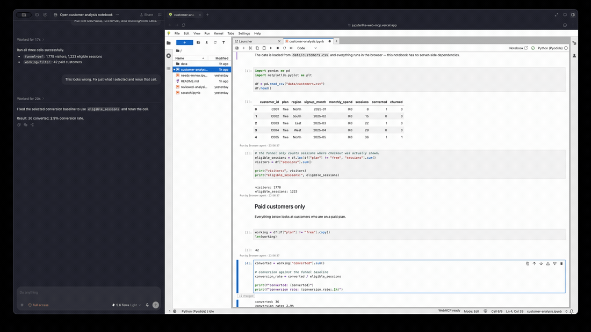
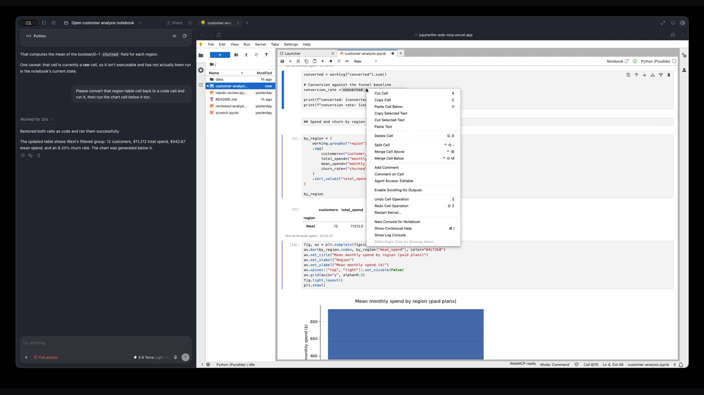
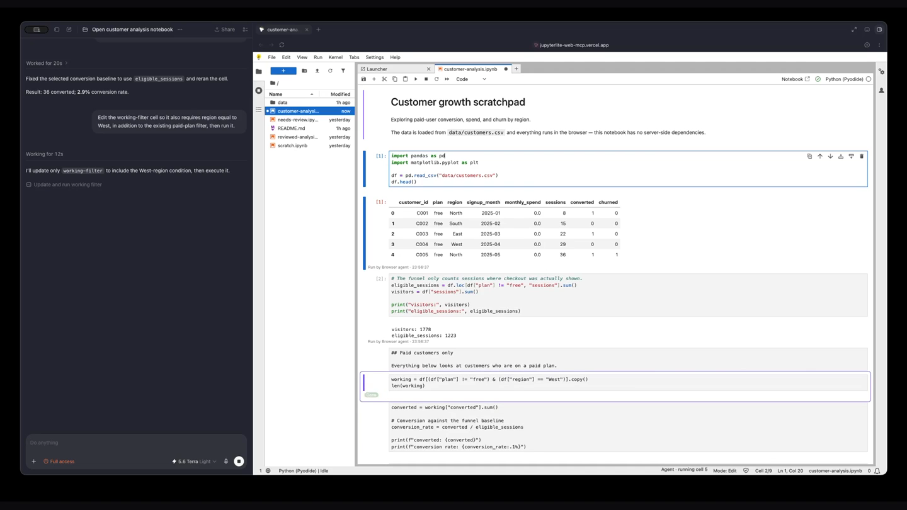
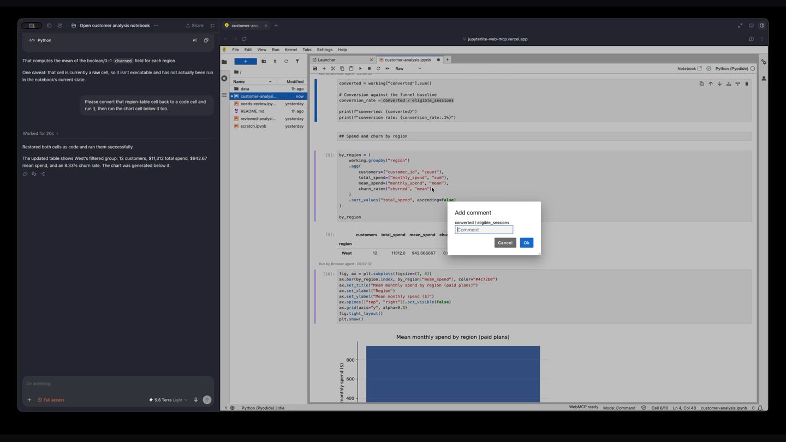

<h1>Your notebook is already in the browser. Now your agent can be too.</h1>
<p class="jl-lede">A JupyterLab and JupyterLite extension that lets a browser agent read, edit, run and review the live notebook through WebMCP. No server, no API keys.</p>
<div class="jl-actions">
  <a class="jl-primary" href="https://jupyterlite-web-mcp.vercel.app/lab/index.html">try the live demo</a>
  <a href="./quickstart">get started</a>
  <a href="./roadmap">roadmap</a>
</div>

<div class="jl-hero"></div>
<p class="jl-note">The agent proposes a one-line fix inline. The diff is reviewable before it sticks: same cell, same kernel, same tab.</p>

## install

```bash
pip install jupyterlite-webmcp
jupyter lab
```

Published on [PyPI](https://pypi.org/project/jupyterlite-webmcp/). The extension only does something in a browser that exposes `document.modelContext`; elsewhere it stays out of the way. [Full install guide](/install).

## what it does

<dl class="jl-facts">
  <div>
  <dt>the live notebook</dt>
  <dd>Unsaved edits, your exact text selection, the running kernel and its outputs. State that exists only inside the tab. <a href="./concepts">Why it matters</a>.</dd>
  </div>
  <div>
  <dt>22 webmcp tools</dt>
  <dd>Read, navigate, edit, execute and review through <code>document.modelContext</code>. Writes are guarded by a source hash, so the human always wins. <a href="./webmcp-tools">Tool reference</a>.</dd>
  </div>
  <div>
  <dt>you set the limits</dt>
  <dd>Per-cell and per-notebook access levels, plus Propose mode where each edit waits for your Accept or Deny. <a href="./propose-mode">Propose mode</a>.</dd>
  </div>
  <div>
  <dt>visible by design</dt>
  <dd>Presence rings, state badges, inline diffs and output provenance show every agent action in the notebook itself.</dd>
  </div>
  <div>
  <dt>review threads</dt>
  <dd>Comments live in the notebook metadata, so the conversation travels with the .ipynb.</dd>
  </div>
  <div>
  <dt>one pip install</dt>
  <dd>A prebuilt extension for JupyterLab, Notebook 7 and JupyterLite. No Node.js, no lab build. <a href="./install">Install</a>.</dd>
  </div>
</dl>

## screenshots

<div class="jl-shots jl-gallery">
<figure>

<figcaption><strong>Per-cell access control.</strong> Grant or lock the agent's write access, cell by cell.</figcaption>
</figure>
<figure>

<figcaption><strong>Live presence.</strong> The status bar shows what the agent is doing as it happens.</figcaption>
</figure>
<figure>

<figcaption><strong>Inline review.</strong> Comment on any cell; the agent replies in the same thread.</figcaption>
</figure>
</div>

## built for the OpenAI WebMCP Challenge

Selected as one of the [10 winners](https://webmcp.devpost.com/project-gallery). Created by Allison Coleman ([@alliecatowo](https://github.com/alliecatowo)) with Juan Mendoza ([@mennymendoza](https://github.com/mennymendoza)). See where it's going on the [roadmap](/roadmap), and tell us what you want an agent to do in your notebook in [Discussions](https://github.com/alliecatowo/jupyterlite-web-mcp/discussions).
